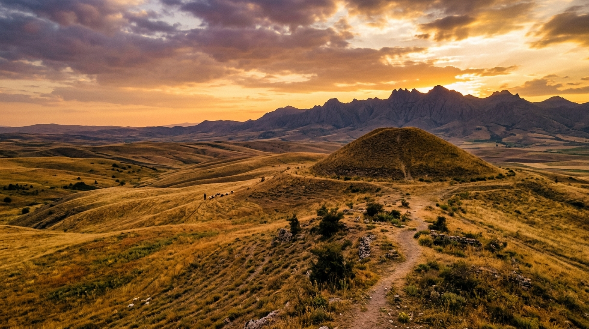

# Bölgesel Tümülüsler, Kaya Anıtları ve Nekropoller



## 1. Giriş ve Coğrafi Yayılım

Kaman havzası ve çevresindeki topoğrafik yükseltiler (özellikle Baranlı Dağı silsilesi, Kargın sırtları, Meşeköy yamaçları ve Hirfanlı boğazı), Erken Tunç Çağı'ndan Geç Roma-Erken Bizans evresine kadar uzanan zengin bir anıtsal mezar ve nekropol peyzajına ev sahipliği yapmaktadır.

Orta Anadolu platosundaki elit mezar mimarisinin en belirgin öğesi olan tümülüsler (yığma mezar tepeleri), Kaman mikro-havzasında stratejik kervan yollarını ve vadi geçitlerini görecek biçimde hâkim sırtlar üzerine konumlandırılmıştır.

```text
               [ BARANLI DAĞI VE ÇEVRE YÜKSELTİLERİ ]
                                 |
        +------------------------+------------------------+
        |                                                 |
[ FRİG TÜMÜLÜSLERİ ]                             [ KAYA OYMA NEKROPOLLERİ ]
 • Ahşap Mezar Odası                              • Tüf Anakaya Odaları
 • Taş/Çakıl Dolgu & Toprak Yığma                 • Arcosolium & Klineler
 • Bronz Situla, Omphalos Çanak                   • Roma-Bizans Yerleşim İzleri
 • Kargın, Savcılı, Ömerhacılı                    • Tatık, Benzer, Meşeköy
```

---

## 2. Demir Çağı ve Frig Tümülüs Mimarisi

Kaman-Kalehöyük çevresindeki yüzey araştırmaları (JIAA Bölgesel Yüzey Araştırması Projesi - Gassan Çukuru Taramaları), çapları 15 ila 45 metre, yükseklikleri ise 2 ila 8 metre arasında değişen 12'den fazla tümülüs varlığını belgelemiştir.

### 2.1. Mezar Odası Strüktürü ve Ahşap Teknolojisi
* **Ahşap Türleri:** Bölgedeki Frig tümülüslerinde Gordion tipi ardıç (*Juniperus excelsa*) ve meşe (*Quercus infectoria*) tomrukları kündekari benzeri zıvana geçmelerle birleştirilmiştir.
* **Dolgu Katmanları:** Mezar odasının üzeri önce kırma kireçtaşı ve andezit bloklarla örtülmüş, ardından su sızdırmazlığını sağlamak amacıyla killi balçık ve nehir çakılı ile katman katman sıkıştırılmıştır.
* **Dromos ve Çatı:** Beşik çatı formundaki ahşap tavanlar, üstteki binlerce tonluk toprak yükünü taşıyacak şekilde bindirme hatıl tekniğiyle desteklenmiştir.

### 2.2. Başlıca Bölgesel Tümülüs Odakları

| Envanter No | Mevkii / Köy | Tahmini Tarihleme | Çap (m) | Yükseklik (m) | Karakteristik Özellikler |
| :--- | :--- | :--- | :--- | :--- | :--- |
| **TUM-01** | Kargın Meşesi Sırtı | Geç Frig (MÖ 7-6. yy) | 38 | 6.5 | Baranlı kütlesine hâkim, taş çekirdekli yığma |
| **TUM-02** | Savcılı Büyükoba Yolu | Frig - Ahameniş Evresi | 28 | 4.2 | Kızılırmak vadisine bakar; bronz halka buluntuları |
| **TUM-03** | Ömerhacılı Höyük Yanı | Orta Demir Çağı | 32 | 5.0 | İkiz tepe yapısı; kireçtaşı krepis duvarı izleri |
| **TUM-04** | Bayındır Yaylası | Hellenistik Çağ (MÖ 3. yy)| 22 | 3.1 | Dromoslu kesme taş sanduka mezar tipi |
| **TUM-05** | Tatık Sırtları | Geç Demir / Galat Tesiri| 25 | 3.8 | Tüf anakaya üzerine toprak yığma |

---

## 3. Kaya Mezarları ve Tüf Anakaya İşçiliği

Kaman'ın kuzey ve kuzeybatısında yer alan tüf ve volkanosedimanter formasyonlar (özellikle Tatık, Benzer ve Sofular köyleri hattı), Kapadokya kaya mimarisinin batı sınırını oluşturur.

### 3.1. Tatık Kaya Yerleşimleri ve Arcosoliumlu Mezarlar
* **Klineli Mezar Odaları:** Kare ya da dikdörtgen planlı, tavanları tonozlu oyulmuş odalarda 1 ila 4 adet ölü sekisi (kline) yer alır.
* **Giriş Cepheleri:** Cephelerde yalın üçgen alınlıklar, kabartma haç motifleri ve Geç Roma dönemi tabula ansata çerçeveli grekçe kitabe yuvaları gözlenir.
* **İşlev Değişimi:** Erken Hristiyanlık ve Bizans döneminde bu kaya mezarlarının bir kısmı inziva hücresine (keşiş odaları) ve tahıl ambarlarına dönüştürülmüştür.

```text
[ Tatık Kaya Mezarı Tipik Kesiti ]
       +-----------------------+
       |   Üçgen Alınlık       |
       +-----------+-----------+
                   |
             [Giriş Açıklığı]
                   |
       +-----------v-----------+
       |       Mezar Odası     |
       |  +----+       +----+  |
       |  |Kline|      |Kline| |
       |  +----+       +----+  |
       +-----------------------+
```

---

## 4. Maden Eserler ve Ölü Hediyesi Envanteri

Kaman çevresindeki kurtarma çalışmalarında ve JIAA yüzey taramalarında belgelenen tipik mezar buluntuları:

1. **Bronz Fibulalar (Çengelli İğneler):** Yarım daire gövdeli, boğumlu ve çift yaylı Frig tipi fibulalar (Blinkenberg Tip XII).
2. **Omphaloslu Göbekli Çanaklar (Phiale):** Dövme bronz teknikle üretilmiş, ritüel sıvı sunusu (libasyon) kapları.
3. **Pişmiş Toprak Unguentariumlar:** Hellenistik ve Erken Roma tabakalarında gözyaşı şişeleri ve merhem kapları.
4. **Demir Silahlar:** Dövme demir mızrak uçları, çift ağızlı kılıç parçaları ve mahmuzlar.

---

## 5. Koruma Durumu, Tehditler ve CBS Tescili

* **Tehdit Unsurları:** Yasadışı define kazıları, tarımsal sürüm faaliyetleri ve erozyon nedeniyle tepelerin basıklaşması.
* **Koruma Stratejisi:** Bütün tümülüs ve kaya mezarları `sit_alanlari.geojson` ve WGS84 koordinat sistemiyle tescillenmiş; Kırşehir Kültür Varlıklarını Koruma Bölge Kurulu envanterine dâhil edilmiştir.
* **Akademik Değer:** Kaman tümülüsleri; Frig metropolü Gordion ile Kapadokya çekirdeği arasındaki kültürel ve siyasi entegrasyonun maddi kanıtlarını teşkil eder.
