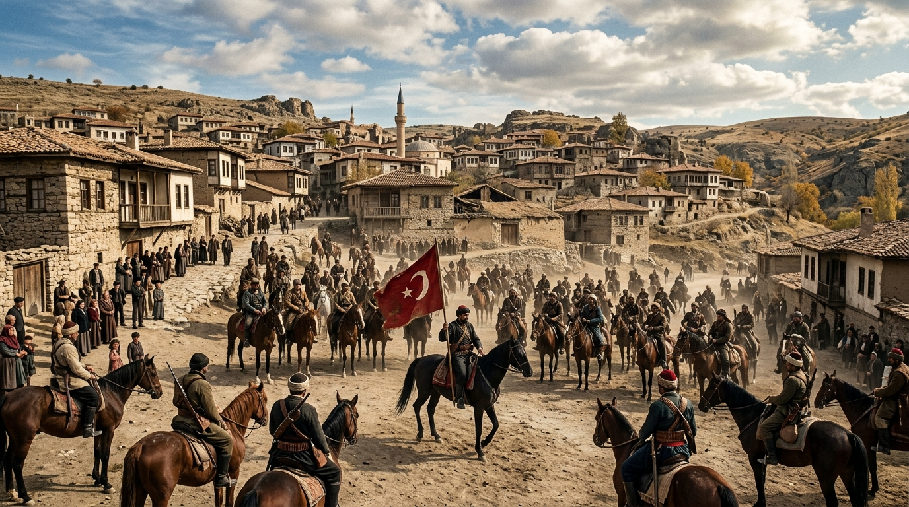

# Kaman ve Çevre Köy Adları Sözlüğü: Etimoloji, Boy Damgaları ve Tahrir İndeksi



> *"Bir köyün adı, o toprağa vurulmuş ilk mührün sesidir. Kaman köylerinin isimleri; Oğuz boylarının tamgalarını, Horasan erenlerinin nefesini ve bozkırın coğrafi çehresini günümüze taşır."*  
> — *Kırşehir ve Çevresi Toponimi Araştırmaları*

Bu sözlük; Kaman ilçe merkezine bağlı köylerin, beldelerin ve eski mezraların **etimolojik kökenlerini**, **Oğuz boyu aidiyetlerini**, Başbakanlık Osmanlı Arşivi (BOA) **Tapu Tahrir Defterleri'ndeki (1528 / 1584 / 1701)** tarihî adlarını ve anlamlarını tasnif etmektedir.

---

## 1. Köy Adları Etimolojik ve Tarihsel Dizini

| Köy Adı | 1528 Tahrir Kaydı | Boy / Cemaat Kökeni | Etimolojik Anlam ve Tarihî Açıklama |
| :--- | :--- | :--- | :--- |
| **Kaman (Merkez)** | *Karye-i Kaman* (TD 139) | Oğuz / Avşar & Kınık | Eski Türkçede "Kam" (bilge din adamı/şifacı) veya Kuman/Kıpçak boy adından türemiştir. |
| **Çağırkan** | *Zâviye-i Çağırkan Baba* | Horasan Derviş Zaviyesi | Çağıran, davet eden, toplayan derviş (Çağırgan Baba). |
| **Savcılı Büyükoba** | *Cemaat-i Savcılı* | Savcı Türkmen Oymağı | Selçuklu ve Danişmendli devrinde elçi/sözcü vazifesi gören Savcı Bey oymağı. |
| **Savcılı Bağbaşı** | *Savcılı Mezraası* | Savcı Türkmen Oymağı | Kızılırmak vadisindeki geleneksel teraslı yamaç bağlarının başlangıcı. |
| **Kargın Meşesi** | *Karye-i Kargın* | Oğuzların Kargın Boyu | 24 Oğuz boyundan biri olan Kargın ("doyurucu, aş ve ekmek sahibi") boyu. |
| **Ömerhacılı** | *Cemaat-i Ömerhacılı* | Mamalu Türkmenleri | Mamalu aşiretine bağlı Hacı Ömer Bey cemaatinin yerleştiği höyük köyü. |
| **Bayındır** | *Karye-i Bayındır* | Oğuzların Bayındır Boyu | 24 Oğuz boyundan biri olan Bayındır ("daima nimetle dolu, bayındır yer"). |
| **Çadırlıhacıbayram** | *Kışlak-ı Çadırlı* | Konar-Göçer Türkmen | Çadır kuran göçerlerin Hacı Bayram Bey önderliğinde yerleşik hayata geçişi. |
| **Çadırlıkörmehmet**| *Kışlak-ı Çadırlı* | Konar-Göçer Türkmen | Çadırlı aşiretinin Kör Mehmet obası yerleşimi. |
| **Demirli** | *Karye-i Timürlü* | Demirci Cemaati | Selçuklu ve Demir Çağı'ndan kalan demir cevheri izleri ve demircilik zanaatı. |
| **Tatık** | *Karye-i Tatık* | Tatık Bey Oymağı | Eski Türkçede "Tat/Tatık" (yerleşik, köylü veya lezzetli su kaynağı). |
| **Kurancılı** | *Karye-i Kurancılı* | Bozok Türkmenleri | Oymak düzeni kuran, oba teşkil eden konar-göçer Türkmen cemaati. |
| **Benzer** | *Karye-i Benzer* | Dulkadirli / Cerid | Kızılırmak kıyısındaki ılıman mikroklima vadisi. |
| **Meşeköy** | *Karye-i Meşeli* | Danişmendli | Baranlı Dağı eteklerindeki kadim meşe (*Quercus*) korulukları. |
| **Baranlı** | *Yayla-i Baranlı* | Dağ Eteği İskânı | Farsça/Türkçe "Baran" (yağmur, bereketli yağmur alan dağ). |
| **Hirfanlı** | *Karye-i İrfanlı* | İrfanlı Cemaati | İrfan sahibi derviş gaziler topluluğu; Kızılırmak boğazı. |
| **Toklumen** | *Karye-i Tokluman* | Türkmen Hayvancıları | "Toklu" (bir yaşındaki erkek kuzu) yetiştiren koyuncu Türkmen obası. |
| **İkizler** | *Karye-i İkizler* | Türkmen Oymağı | Karşı karşıya duran iki antik höyükten (İkiz Höyük) adını almıştır. |
| **Karakaya** | *Mezraa-i Karakaya* | Bozok Türkmenleri | Baranlı kütlesine ait volkanik/bazalt siyah kayalıklar. |
| **Yassıhöyük** | *Karye-i Höyük* | Kadim İskân | Yayvan ve basık formlu Demir Çağı höyüğü eteğindeki yerleşim. |

---

## 2. Toponimik Morfoloji ve Sınıflandırma

Kaman yer adları 4 ana morfolojik gruba ayrılır:

```text
                                [ KAMAN KÖY ADLARI ]
                                          |
        +------------------+--------------+------------------+
        |                  |                                 |
[ OĞUZ BOY ADLARI ]   [ ŞAHIS & OYMAK ]               [ COĞRAFİ & DOĞAL ]
 • Bayındır (Boy)      • Ömerhacılı                    • Meşeköy (Bitki)
 • Kargın (Boy)        • Çadırlıhacıbayram             • Karakaya (Jeoloji)
 • Kaman (Kam/Kuman)   • Çağırkan (Derviş)             • Baranlı (İklim/Yağmur)
```

1. **Oğuz Boy ve Cemaat Adları:** Bayındır, Kargın, Savcılı, Mamalu, Cerid.
2. **Şahıs ve Kurucu Bey Adları:** Ömerhacılı, Hacıbayram, Kör Mehmet, Çağırkan Baba.
3. **Coğrafi ve Jeomorfolojik Adlar:** Karakaya, Yassıhöyük, Meşeköy, Değirmendere.
4. **Tarımsal ve Hayvancılık Pratikleri:** Toklumen (kuzuculuk), Bağbaşı (üzümcülük).

---

## 3. Arşiv Kaynakçası

* **BOA Tapu Tahrir Defteri No: 139** (H. 935 / M. 1528 *Kırşehri Livası Mufassal Defteri*).
* **BOA Tapu Tahrir Defteri No: 998** (H. 992 / M. 1584 *Bozok Sancağı İcmal Defteri*).
* **Yusuf Halaçoğlu**, *Anadolu'da Aşiretler, Cemaatler, Oymaklar (1453-1650)*, Cilt 1-6, TTK Yayınları.
