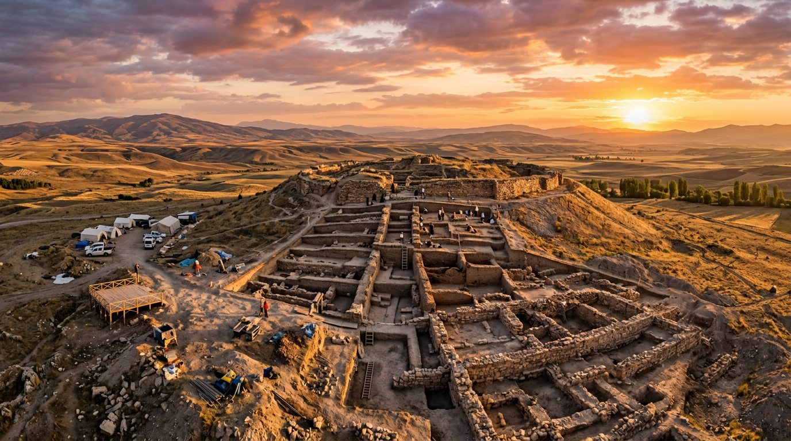
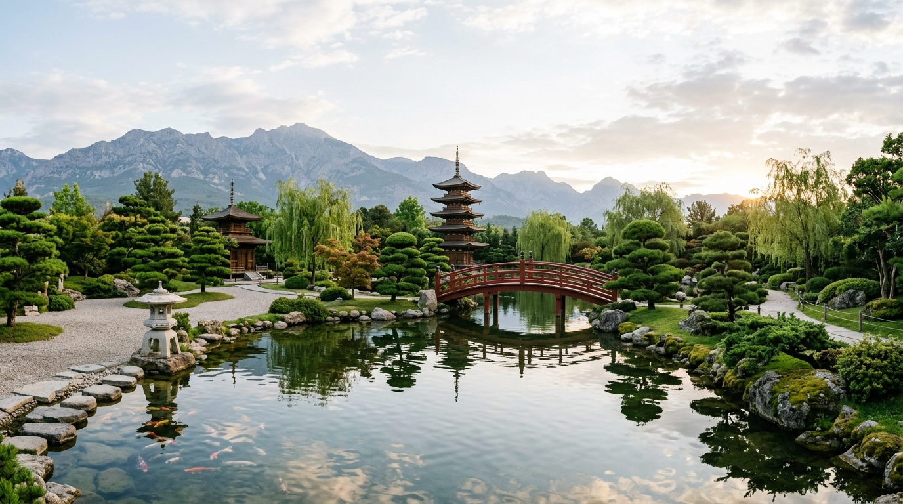
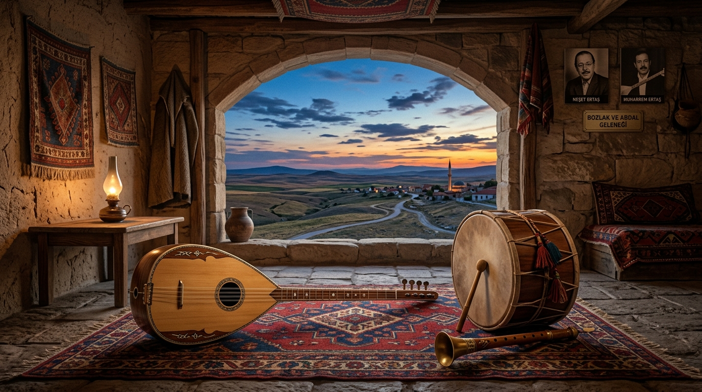
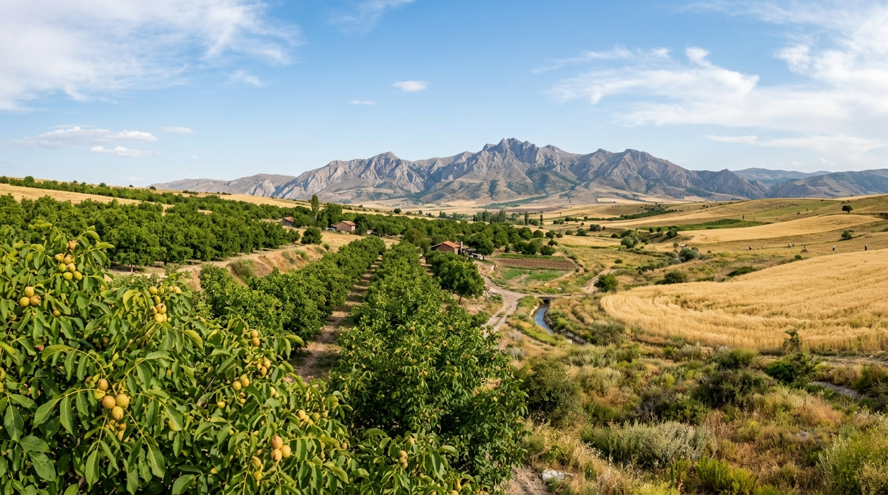
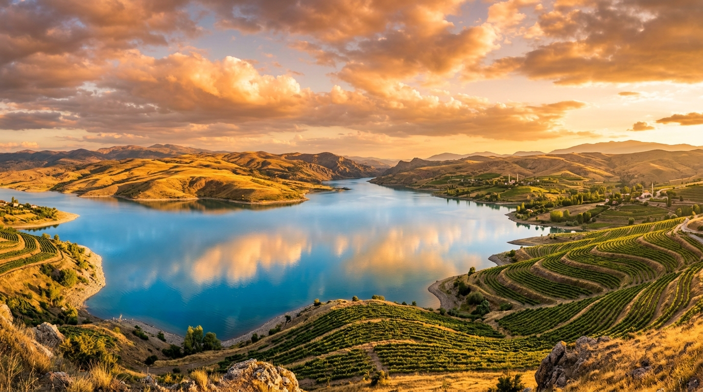

# Bozkır Havzası Kaman: Arkeoloji, Coğrafya ve Yerel Hafıza Monografisi

[](https://github.com/arch-yunus/bozkir-havzasi-kaman/actions/workflows/validate-and-test.yml)
[](https://creativecommons.org/licenses/by-sa/4.0/)
[](05_gorsel_ve_kartografik_arsiv/haritalar/)
[](05_gorsel_ve_kartografik_arsiv/haritalar/kaman_arkeoloji_atlasi.kml)
[](index.html)



> *"Anadolu'nun bağrında kazdığımız her tabaka, sadece toprağın değil; Doğu ile Batı'nın, kadim krallıkların ve göç yollarının kesiştiği insanlık hafızasının katmanlarıdır. Kalehöyük, bozkırın ortasında bin yıllar boyunca sönmemiş bir ocaktır."*  
> — **Dr. Sachihiro Omura**, *Japon Anadolu Arkeoloji Enstitüsü (JIAA) Kazı Günlükleri*

> *"Toprak dedikleri kuru bir çamur yığını değildir; altı bin yıllık ocakların külü, üstü sayısız kavmin fırtınasıdır. Kaman dediğin yer, rüzgârın kervan yoluna fısıldadığı o kesintisiz türküdür."*  
> — *Kırşehir Monografi ve Halk Bilimi Notları*

Bu araştırma külliyatı ve açık kaynak veri deposu; Orta Anadolu yaylasının stratejik kavşağında yer alan **Kırşehir / Kaman** mikro-havzasını arkeolojik, tarihsel, ekolojik, dilbilimsel, sosyolojik ve folklorik katmanlarıyla bir bütün olarak ele almaktadır. 

Erken Tunç Çağı'ndan Demir Çağı'na, Hitit çekirdek bölgesinden Selçuklu-Osmanlı iskân hareketlerine, Millî Mücadele'nin Heyet-i Temsiliye intikal hattından Abdal/bozlak hafızasına uzanan bu monografi; Kaman'ı salt bir idari sınır olarak değil, Kızılırmak kavisinde şekillenmiş dinamik ve kadim bir **"Bozkır Havzası"** olarak modeller.

---

## 🗺️ İnteraktif Web CBS Atlası & Görsel Portali

Depo bünyesinde; tüm höyüklerin, tümülüslerin, köylerin ve doğal alanların konumsal olarak incelenebildiği, istatistiki grafiklerin ve müzik/fenoloji/Japon Bahçesi matrislerinin yer aldığı tek sayfalık modern bir **Web CBS Atlası** ([index.html](index.html) / [docs/index.html](docs/index.html)) bulunmaktadır.

- **Canlı Harita:** OpenStreetMap & Leaflet.js tabanlı, 20 tescilli odak noktası, filtreli ve ölçüm destekli katmanlar.
- **🌸 Mikasanomiya Japon Bahçesi Sekmesi:** 22.000 m² alanıyla Japonya dışındaki en büyük botanik Japon bahçesinin bitki envanteri ve Zen rehberi.
- **İstatistik Paneli:** Rakım histogramları (820m - 1677m), boy/oymak dağılımları, tarımsal desen grafikleri (Chart.js).
- **Müzik Antropolojisi:** Bozlak perde ve makam düzenleri (Garip Ayağı).
- **Agronomi Takvimi:** Kaman cevizi fenolojik döngüsü ve don koruma rehberi.
- **Canlı Canlı Çalıştırma:** Herhangi bir sunucu kurulumu gerektirmeden `index.html` dosyasına çift tıklayarak tarayıcınızda açabilirsiniz.

---

## 📜 Tematik Alıntılar ve Hafıza Fragmanları

### I. Kazma, Çapa ve Stratigrafi: Toprağın Katmanları



> *"Bozkırın sessizliği aldatıcıdır. Rüzgârın sürüklediği tozun birkaç metre altında; Hitit mühürleri, Asur ticaret kolonilerinin kervan tabletleri ve Demir Çağı'nın yanmış sur duvarları yan yana uyur."*  
> — *Anatolian Archaeological Studies (JIAA Saha Notları)*

> *"Kaman-Kalehöyük, 280 metre çapında ve 16 metre yüksekliğinde tipik bir İç Anadolu tepe yerleşimi görünümündedir; fakat derinliğine inildikçe kesintisiz stratigrafisiyle tüm Yakındoğu kronolojisini doğrulayan canlı bir takvim taşır."*  
> — **Dr. Kimiyoshi Matsumura**

> *"Anadolu'yu anlamak isteyen adam taşa değil, çanağın kırığına baksın. Kalehöyük'ün çamurunda MÖ ikinci binyılın parmak izi hâlâ durur; kuruyan çamur, ustasının elini unutmamıştır."*  
> — *Kazı Alanı Sözlü Arşivi*

> *"Tarih, büyük sarayların mermerlerinde değil; bozkır köylüsünün tahıl depoladığı küplerde, yangın tabakalarının kömürleşmiş buğday tanelerinde saklıdır."*  
> — *Kaman Çevresi Arkeobotanik Saha Raporu*

> *"Mikasanomiya bahçesine diktiğimiz her ardıç, Kalehöyük'ün MÖ üçüncü bin yılındaki hatıllarına selam durur. Toprak hafızasını kaybetmez; bitki de insan da köklerine döner."*  
> — **Prens Takahito Mikasa**, *JIAA Açılış Nutku (1993)*

---

### II. Ozanlar Ocağı, Bozlak ve Abdal Nefesi



> *"Bizim sazımızın teli bozkırın kuru otuna benzer; dokunsan yanar, dokunmasan rüzgârda inler. Biz insanı insan biliriz, bu toprak bizi sazımızla bildi."*  
> — *Kırşehir-Kaman Abdal Havzası Sözlü Mülakatları*

> *"Dost elinden gel olmazsa varılmaz / Rızasız bahçenin gülü derilmez / Kalpten kalbe bir yol vardır görülmez / Gönülden gönüle giden yol gizli..."*  
> — **Neşet Ertaş**

> *"Bozkırda türkü söylemek bağırmak değildir; rüzgâra, dağa, ıssızlığa karşı içindeki yangını savurmaktır. Bozlak, yerleşik nizama sığmayan göçer Türkmen'in ötelerden getirdiği iç çekişidir."*  
> — **Cahit Obruk**, *Bozkır Tezkereleri*

> *"Muharrem Usta çaldığı vakit saz ağlamazdı; toprağın altındaki su sızlar, gökteki turna rotasını şaşırırdı. Kırşehir ile Kaman arası sazın perdesinde ölçülür, kilometreyle değil."*  
> — *Yerel Cönk ve Meclis Notları*

> *"Çekiç Ali zurnaya nefes vurduğunda Baranlı Dağı'nın yankısı düğün meydanına inerdi. Çekiç'in parmağındaki çeviklik, bozkır şahininin süzülüşü gibiydi."*  
> — *Kaman Düğün Belleği Mülakatları*

> *"Âşık Said der ki çağlar gözlerim / Yârdan ayrılalı dinmez sızılarım / Bozkırın bağrında kaldı izlerim / Kaman'ın yoluna düştüm ağlarım..."*  
> — **Âşık Said**, *Kırşehir-Kaman Divânı*

---

### III. Bozkır Ekolojisi, Sert Ayaz ve Kaman Ağacı



> *"Kaman’ın taşı sert, suyu kıt lakin cevizi cömerttir. İnce kabuğun ardındaki o ak meyve, bozkırın çorak ayazına inat toprağın derinlerinden emilen sabrın mahsulüdür."*  
> — *Kaman Yerel Monografi Derlemesi*

> *"Baranlı Dağı'nın sisi kalkmadan Kaman'a bahar gelmez; ceviz çiçeği ayazı görmeden içinin yağını bağlamaz."*  
> — *Kaman Yaşlılar Meclisi Anlatısı*

> *"Bozkır insanı ağacı sadece gölge bilmez; ağaç burada toprağın direği, rüzgârın freni, çölleşen yalnızlığın yegâne yeşil sığınağıdır."*  
> — *İç Anadolu Step Ekolojisi Araştırmaları*

> *"Geven dediğin kuru bir diken yumağı sanılır; oysa toprağı tırnaklarıyla tutan odur. Gevenin söküldüğü yerde rüzgâr tarlayı sıyırır götürür."*  
> — *Bozkır Erozyon ve Toprak İncelemeleri*

---

### IV. Kızılırmak Havzası, Hirfanlı Sahili ve İskân Hatları



> *"Hükm-i şerîf sâdır olmuşdur ki: Bozok ve Kırşehri sancağında perakende olan cemaatler ve taifeler, zikrolunan Kaman ve tevabii yaylaklarında ve kışlaklarında sakin olup nizam üzere ziraat ve hıraset ile meşgul olalar..."*  
> — *Başbakanlık Osmanlı Arşivi, Mühimme Defteri (17. Yüzyıl İskân Kaydı)*

> *"Konar-göçerin evi sırtındadır; kışın Kızılırmak boyuna iner, yazın Baranlı'nın eteğine çadır kurar. Onlar için sınır hudut değil, suyun ve otun bittiği yerdir."*  
> — **Prof. Dr. Faruk Sümer**

> *"Savcılı koyundan esen yel, Hirfanlı'nın kokusunu getirir. Bozkırın ortasında deniz havası solumak istersen Savcılı'nın bağlarına varacaksın."*  
> — *Kızılırmak Kıyısı Seyahat Notları*

---

### V. Baranlı Yamaçları, Tümülüsler ve Demir Çağı Nekropolleri


> *"Baranlı silsilesinin sırtlarına dizilmiş Frig tümülüsleri; bozkırın rüzgârında sessizce bekleyen bin yıllık bekçiler gibidir. Ahşap mezar odalarındaki her ardıç tomruğu, Gordion ile Kaman arasındaki kadim bağı fısıldar."*  
> — *Gassan Çukuru Yüzey Araştırması Raporları*

> *"Toprağın altına gömülen bronz phiale ve fibulalar, sadece bir ölünün anısını değil; Demir Çağı Maden ustasının ateşe ve metale hükmetme maharetini taşır."*  
> — *Anadolu Metalurji Raporları*

---

### VI. Millî Mücadele, Seymen Alayı ve 1919 Kaman İntikali


> *"Mucur ve Kırşehir tarîkiyle Kaman kasabasına muvasalat olunmuştur. Ahali ve kuva-yı milliyemizin azim ve hissiyatı fevkalade yüksektir. Yarın sabah Ankara istikametine hareket edilecektir."*  
> — **Mustafa Kemal Paşa**, *Kaman Telgrafhanesi (24-25 Aralık 1919)*

> *"Vatanın halası için Paşa Hazretlerinin ardında birleşmek her ferde farzdır. Kaman'dan Ankara'ya açılan kapı, hürriyet kapısıdır."*  
> — **Çelebi Cemalettin Efendi**

---

## 🏛️ Kalehöyük Stratigrafik Sentez Matrisi

Kaman-Kalehöyük kazılarında belgelenen 4 ana kültür katı ve 16 alt evrenin kronolojik karşılaştırma tablosu:

| Kat | Tarihlendirme | Kültür / Uygarlık | Tipik Mimari & Yapısal Nitelik | Karakteristik Maddi Kültür Buluntuları |
| :--- | :--- | :--- | :--- | :--- |
| **I. Kat** | MS 11 – 17. yy | Osmanlı & Selçuklu Çağı | Basit taş temelli kırsal konutlar, tahıl siloları | Sgraffito sırlı seramikler, gümüş akçeler, pipolar |
| **IIa Katı**| MÖ 600 – 330 | Geç Demir / Ahameniş-Pers | Taş temelli kerpiç konutlar, idari yapılar | İthal Attika seramikleri, piramidal damga mühürler |
| **IIb Katı**| MÖ 800 – 600 | Orta Demir / Frig Dönemi | Anıtsal sur duvarları, demir tasfiye fırınları | Boyalı Frig panelleri (geyik/kuş), bronz fibulalar |
| **IIc Katı**| MÖ 1200 – 800 | Erken Demir / "Karanlık Çağ"| Ahşap dikmeli hafif yapılar, ocak tabanları | El yapımı açkılı kaba seramik, ilk demir aletler |
| **IIIa Katı**| MÖ 1650 – 1200| Hitit İmparatorluk & Eski Hitit| Çok odalı taş temelli saray/idari kompleksler | Hitit hiyeroglif bullaları, kırmızı açkılı gagalı testiler |
| **IIIb Katı**| MÖ 1950 – 1650| Asur Ticaret Kolonileri | Bitişik nizam depolar, yangın tabakaları | Silindir mühür baskıları, ritonlar, pithos depoları |
| **IV. Kat** | MÖ 2800 – 2000| Erken Tunç Çağı (ETÇ II-III) | Kalın kerpiç duvarlar, pithos mezar odaları | Depas kaplar, arsenikli bakır döküm kalıpları |

---

## 📍 20 Tescilli Sit ve Odak Noktası Envanteri

Açık kaynak CBS veri setimizde (`sit_alanlari.geojson` ve `kaman_koyler_ve_nufus.csv`) yer alan 20 tescilli merkez:

| Kod | Alan Adı | Kategori | Rakım | Koordinat (Lat, Lon) | Tarihsel & Kültürel Fonksiyon |
| :--- | :--- | :--- | :--- | :--- | :--- |
| **SIT-01** | Kaman-Kalehöyük | Arkeolojik Sit | 1015 m | 39.3582, 33.7236 | 1986'dan beri kazılan 4 katmanlı stratigrafik merkez höyük |
| **SIT-02** | Mikasanomiya Anı Bahçesi | Doğal / Peyzaj | 1020 m | 39.3595, 33.7258 | 22.000 m² alanıyla Japonya dışındaki en büyük Japon bahçesi |
| **SIT-03** | Kaman Kalehöyük Müzesi | Müze Yapısı | 1018 m | 39.3588, 33.7242 | Höyük formunda yeşil çatılı uluslararası arkeoloji müzesi |
| **SIT-04** | Büklükale Garnizonu | Arkeolojik Sit | 820 m | 39.6012, 33.4385 | Kızılırmak Çeşnigir boğazını denetleyen Hitit garnizon kalesi |
| **SIT-05** | Yassıhöyük | Arkeolojik Sit | 980 m | 39.2945, 33.7012 | Savcılı vadisi girişini kontrol eden Demir Çağı höyüğü |
| **SIT-06** | Baranlı Dağı Zirvesi | Doğal / Tarihsel | 1677 m | 39.4125, 33.8214 | Kaman'ın en yüksek kütlesi; antik yangın ve gözetleme kulesi |
| **SIT-07** | Savcılı Büyükoba Sahili | Ekolojik / Rekreasyon | 860 m | 39.2456, 33.5823 | Hirfanlı baraj sahili, ılıman mikroklima ve yamaç bağcılığı |
| **SIT-08** | Kargın Meşesi Tümülüsleri | Tümülüs / Nekropol | 1130 m | 39.3890, 33.7845 | Baranlı eteklerine hâkim anıtsal Frig yığma mezarları |
| **SIT-09** | Çağırkan Baba Türbesi | Dini / Tarihi Anıt | 1025 m | 39.3610, 33.7265 | Horasan dervişlerinden Çağırkan Baba'nın Selçuklu zaviyesi |
| **SIT-10** | Ömerhacılı Höyüğü | Arkeolojik Sit | 995 m | 39.3620, 33.7210 | Verimli tarım depresyonunda çok katmanlı höyük yerleşimi |
| **SIT-11** | Atatürk Karşılama Mevkii | Tarihi İskân | 1005 m | 39.3560, 33.7225 | 24 Aralık 1919'da Heyet-i Temsiliye'nin karşılandığı meydan |
| **SIT-12** | Çadırlıhacıbayram Çeşmesi | Tarihi Yapı | 960 m | 39.3210, 33.6420 | 18. yy konar-göçer iskânını simgeleyen Osmanlı çeşmesi |
| **SIT-13** | Kurancılı Beldesi | Tarihsel İskân | 1080 m | 39.4210, 33.7530 | Baranlı eteklerinde kadim Türkmen yerleşimi |
| **SIT-14** | Hirfanlı Barajı Gövdesi | Endüstriyel Miras | 850 m | 39.2710, 33.5210 | 1959 yapımı Kızılırmak üzerindeki ilk büyük hidroelektrik barajı |
| **SIT-15** | Bayındır Tümülüsü | Tümülüs | 1030 m | 39.3850, 33.6120 | Oğuzların Bayındır boyunun adını taşıyan Hellenistik mezar |
| **SIT-16** | Tatık Kaya Mezarları | Arkeolojik Sit | 1110 m | 39.4420, 33.6890 | Tüf anakayaya oyulmuş Roma-Bizans arcosoliumlu mezarları |
| **SIT-17** | Savcılı Bağbaşı Terasları | Tarımsal Miras | 870 m | 39.2150, 33.5640 | Geleneksel kuru taş teraslı bağcılık ve pekmez ocakları |
| **SIT-18** | İkizler Höyüğü | Arkeolojik Sit | 990 m | 39.3120, 33.7910 | Kaman güneydoğu ovasındaki ikiz tepe höyük oluşumu |
| **SIT-19** | Kaman Ceviz Genetik Alanı | Agronomik Alan | 1010 m | 39.3520, 33.7350 | Kaman-1, Kaman-2 ve Kaman-5 damızlık araştırma parseli |
| **SIT-20** | Demirli Su Değirmenleri | Kültür Varlığı | 1050 m | 39.4600, 33.6300 | Değirmendere vadisinde su çarklı taş değirmen kompleksleri |

---

## 👥 Kaman'ın Yetiştirdiği Tarihi Şahsiyetler ve Bilgeler

1. **Âşık Said (1835 – 1910, Toklumen):** Orta Anadolu âşıklık geleneğinin piri, Baranlı ve Kaman koşmalarının usta şairi.
2. **Âşık Seyfullah (1871 – 1947, Toklumen):** Âşık Said'in oğlu; Seferberlik ve İstiklal Harbi yıllarının ağıtçısı.
3. **Çağırkan Baba (13.–14. yy):** Yesevi ocağına bağlı Horasan ereni; Kaman havzasının manevi kurucusu ve zaviye banisi.
4. **Çelebi Cemalettin Efendi (1862 – 1921):** Hacıbektaş Dergâhı Postnişini, TBMM I. Dönem Başkanvekili; 1919'da Atatürk'ü Kaman'da ağırlayan lider.
5. **Çekiç Ali (Ali Ersan, 1932 – 1973):** Saz ve zurnanın efsanevi çevik virtüözü; Kaman ve Kırşehir düğün ekolü kurucusu.
6. **Muharrem Ertaş & Neşet Ertaş:** Kaman-Kırşehir Abdal havzasının yaşayan insan hazineleri, bozlak ve Garip ayağı ustaları.
7. **Müftü Mehmet Faik Efendi & Bekir Çavuş (1919):** Kaman Müdafaa-i Hukuk Teşkilatçıları ve atlı Seymen Alayı kumandanları.
8. **Dr. Lokman Avşar:** Kaman cevizini bilimsel tescille dünya literatürüne kazandıran ziraat araştırmacısı.

---

## 🌰 Kaman Cevizi Agronomik ve Fenolojik Özellikleri

| Çeşit Kodu | Kabuk Özelliği | Randıman (%) | Yağ Oranı (%) | Soğuklama İhtiyacı | İlkbahar Geç Don Riski |
| :--- | :--- | :--- | :--- | :--- | :--- |
| **Kaman-1** | İnce Kabuk (Elle kırılır) | %55 – %58 | %68 – %72 | 900 – 1100 saat | Orta (Geç yapraklanan seleksiyon) |
| **Kaman-2** | Orta-İnce Kabuk | %50 – %54 | %65 – %68 | 850 – 1000 saat | Düşük-Orta |
| **Kaman-5** | Ekstra İnce (İpek Kabuk) | %60 – %64 | %70 – %74 | 1000 – 1200 saat | Çok Geç Uyanır (Yüksek Don Dayanımı) |

---

## 📂 Dizin Yapısı ve Belge Mimarisi (37 Bölüm ve Rehber)

```text
bozkir-havzasi-kaman/
├── 01_arkeoloji_ve_kazilar/
│   ├── 01_kalehoyuk_stratigrafi.md              # Tabakalanma, seramik tipolojisi, mimari evreler
│   ├── 02_jiaa_enstitu_tarihcesi.md             # Enstitünün kuruluşu, Prens Mikasa ve Omura arşivi
│   ├── 03_buklukale_ve_yassihoyuk.md            # Bölgesel höyük sistemleri ve nehir geçitleri
│   ├── 04_arkeometrik_veriler.md                # Radyokarbon (C14), botanik ve osteoloji tahlilleri
│   ├── 05_japon_bahcesi_ekolojisi.md            # Mikasanomiya anı bahçesi ve peyzaj mimarisi
│   ├── 06_muze_katalogu_ve_secme_eserler.md     # Kaman Kalehöyük Arkeoloji Müzesi seçme eserler envanteri
│   ├── 07_kalehoyuk_maden_ve_demir_cagi_metalurjisi.md # Tunç ve demir fırınları, cüruf ve çelik metalurjisi
│   ├── 08_bolgesel_tumulusler_ve_kaya_anitlari.md # Baranlı ve çevre tümülüsleri, kaya mezarları ve nekropoller
│   └── 09_kalehoyuk_zooarkeoloji_ve_fauna.md    # Hayvan kemiği analizleri, evcilleştirme ve fauna evrimi
├── 02_cografya_ve_ekolojik_yapi/
│   ├── 01_jeomorfoloji_ve_iklim.md              # Baranlı kütlesi, vadi tabanları, yağış rejimleri
│   ├── 02_ceviz_botanigi_ve_tarim.md            # Kaman cevizi seleksiyonları ve toprak talepleri
│   ├── 03_su_ve_kizilirmak_havzasi.md           # Akarsular, çeşmeler, göletler ve kuraklık verileri
│   ├── 04_endemik_flora_ve_step.md              # Geven, yavşan otu ve step vejetasyonu envanteri
│   ├── 05_iklim_krizi_ve_havza_hidrolojisi.md   # Kuraklık indisleri (SPI/SPEI) ve yeraltı su krizi
│   ├── 06_baranli_dagi_jeolojisi_ve_plutonizim.md # Baranlı granitoyidi, skarn zonları ve jeomorfolojik evrim
│   └── 07_kaman_toprak_tipleri_ve_pedoloji.md   # Toprak pedolojisi, derin alüvyon ve ceviz ekolojisi
├── 03_tarihsel_belgeler_ve_iskan/
│   ├── 01_osmanli_tahrir_kayitlari.md           # 16. yy Bozok ve Kırşehir livası tahrir transkripsiyonları
│   ├── 02_asiretler_ve_konar_gocer.md           # Türkmen boyları, cemaatler ve iskân fermanları
│   ├── 03_vakfiyeler_ve_seriyye.md              # Cami, zaviye, medrese vakıf kayıtları ve mahkeme hüccetleri
│   ├── 04_milli_mucadele_donemi.md              # Heyet-i Temsiliye'nin Kırşehir-Kaman temasları
│   ├── 05_seyyahlar_ve_salnameler.md            # Evliya Çelebi, Salnameler ve Batılı seyyah kayıtları
│   ├── 06_kaman_nufus_defterleri_1831_1845.md   # 1831 Nüfus ve 1845 Temettuat hane gelirleri envanteri
│   ├── 07_ataturk_kaman_gunlugu_1919.md         # 24-25 Aralık 1919 Mustafa Kemal Paşa Kaman konaklaması
│   ├── 08_kaman_ve_cevre_koy_adlari_sozlugu.md  # Köy adları etimolojisi, Oğuz boyları ve tahrir indeksi
│   └── 09_kaman_ticaret_ve_kervan_yollari_tarihi.md # Asur Kolonileri, Kral Yolu, İpek Yolu ve derbentler
├── 04_folklor_ve_sozlu_bellek/
│   ├── 01_bozlak_ve_muzik_antropolojisi.md      # Abdal geleneği, perde düzenleri, ezgi kalıpları
│   ├── 02_toponimi_ve_koy_monografileri.md      # Köy adlarının morfolojik ve tarihsel kökeni
│   ├── 03_yerel_sozluk_ve_atasozleri.md         # Kaman ağzı derlemeleri ve arkaik Türkçe kelimeler
│   ├── 04_agitlar_ve_destanlar.md               # Bölgesel ağıtlar, düğün adetleri ve seyirlik oyunlar
│   ├── 05_kaman_divani_ve_siir_antolojisi.md    # Kaman, Baranlı ve Bozlak şiir antolojisi
│   ├── 06_kaman_mutfagi_ve_gastronomi.md        # Geleneksel yemekler, cevizli çörek ve bağcılık mutfağı
│   ├── 07_halk_hekimligi_ve_etnobotanik.md      # Şifalı step bitkileri, ocaklık ve sınıkçılık geleneği
│   ├── 08_kaman_abdal_ocaklari_ve_muharrem_ertas.md # Muharrem Ertaş ekolü, soy kütükleri ve icra tavrı
│   ├── 09_kaman_yetistirdigi_sahsiyetler_ve_biyografiler.md # Âşık Said, Seyfullah, Çelebi Cemalettin biyografileri
│   ├── 10_turk_edebiyatinda_kaman_ve_bozkir_metinleri.md # Tanpınar, Yaşar Kemal, Âşık Paşa, Bedri Rahmi edebiyat antolojisi
│   ├── 11_kaman_masallari_efsaneleri_ve_mitoloji.md # Gelin Kayası, Çağırkan Asa Pınarı ve Kırk Kızlar efsaneleri
│   └── 12_cunkler_ve_el_yazmasi_siir_defterleri.md # 18-19. yy el yazması cönkler ve derkenar kayıtları
├── 05_gorsel_ve_kartografik_arsiv/
│   ├── haritalar/
│   │   ├── README.md                            # Kartografik kaynaklar ve GIS metodolojisi
│   │   ├── sit_alanlari.geojson                 # Koordinatlandırılmış höyük, anıt ve köy ağları (20 nokta)
│   │   ├── kaman_koyler_ve_nufus.csv            # 20 köyün rakım, boy kökeni ve ürün tabular veri seti
│   │   └── kaman_arkeoloji_atlasi.kml           # Google Earth Pro ve CBS 3D KML envanter dosyası
│   └── fotograflar/
│       ├── 01_banner_kaman_kalehoyuk.jpg        # Kalehöyük kazı alanı ve bozkır ufku panoraması
│       ├── 02_banner_mikasanomiya_japon_bahcesi.jpg # Mikasanomiya Japon Bahçesi ve gölet panoraması
│       ├── 03_banner_kaman_ceviz_ve_baranli.jpg # Kaman ceviz bahçeleri ve Baranlı Dağı panoraması
│       ├── 04_banner_kirsehir_abdal_bozlak.jpg  # Bozlak ozanı ve Kırşehir-Kaman saz geleneği panoraması
│       ├── 05_banner_hirfanli_kizilirmak_havzasi.jpg # Kızılırmak ve Hirfanlı Baraj Gölü sahili panoraması
│       ├── 06_banner_kaman_tumulus_ve_nekropol.jpg # Baranlı Demir Çağı ve Frig tümülüsleri panoraması
│       ├── 07_banner_kaman_ataturk_ve_iskan.jpg # 1919 Kaman Seymenleri ve tarihi iskân panoraması
│       └── README.md                            # Görsel arşiv ve 7 banner metaveri kataloğu
├── assets/
│   └── banners/                                 # 7 adet yüksek çözünürlüklü tematik monografi bannerı
├── docs/
│   ├── index.html                              # GitHub Pages için Web CBS Portalı
│   ├── kaman_kultur_ve_turizm_gezi_rotalari.md # 1, 2 ve 3 günlük tematik gezi ve kültür rotaları
│   ├── kaman_arkeometri_ve_c14_tarihleme_katalogu.md # OxCal C14 radyokarbon ve dendrokronoloji veritabanı
│   ├── kaman_analiz_raporu.md                  # Otomatik sentez ve mekânsal analiz raporu
│   ├── kronoloji_cetveli.md                     # MÖ 2800'den günümüze karşılaştırmalı matris
│   ├── ceviz_yetistiriciligi_rehberi.md         # Kaman cevizi agronomik bakım ve don koruma rehberi
│   ├── sozlu_tarih_mulakat_protokolu.md         # Saha çalışması mülakat soru setleri ve protokolü
│   └── sociology/
│       ├── kaman_ve_ag_kapitalizmi_analizi.md   # Bozkır sosyolojisi ile vadi tipi şebeke kapitalizmi analizi
│       └── ahilik_ve_abdal_etik_matrisi.md      # Ahilik ve Abdal geleneği karşılaştırmalı etik matrisi
├── scripts/
│   ├── analyze_kaman_data.py                    # GeoJSON & CSV mekânsal istatistik, centroid ve mesafe analiz aracı
│   ├── export_kml.py                            # GeoJSON & CSV'den 3D KML Google Earth üretim aracı
│   ├── validate_dataset.py                      # CI/CD veri bütünlüğü, markdown linter ve link test aracı
│   └── generate_report.py                       # Otomatik analiz ve sentez raporu üreticisi
├── .github/
│   └── workflows/
│       └── validate-and-test.yml                # Çoklu Python sürümlerinde otomatik CI/CD test hattı
├── index.html                                   # İnteraktif Web CBS Atlası ve Görsel Monografi Gezgini
├── CONTRIBUTING.md                              # Veri ekleme, kaynak gösterme ve transkripsiyon kılavuzu
├── BIBLIOGRAPHY.md                             # Kapsamlı bibliyografya ve kaynakça indeksi
└── README.md
```

---

## 🛠️ CLI ve Analitik Araçların Kullanımı

Depodaki Python araçları harici kütüphane bağımlılığı olmadan standart Python ile çalışır:

```bash
# 1. Veri setleri, Markdown bağlantıları ve 7 görsel banner bütünlüğünü test edin:
python scripts/validate_dataset.py

# 2. Mekânsal istatistikler, mesafe matrisleri ve hipsometrik analizleri çalıştırın:
python scripts/analyze_kaman_data.py

# 3. Google Earth ve CBS yazılımları için KML dosyası üretin:
python scripts/export_kml.py

# 4. Otomatik sentez ve analiz raporunu güncelleyin:
python scripts/generate_report.py
```

---

## 📖 Akademik Atıf Formatı (Citation)

Bu külliyatı bilimsel makalelerinizde veya araştırmalarınızda kullanırken aşağıdaki formatta kaynak gösterebilirsiniz:

```bibtex
@misc{bozkir_havzasi_kaman_2026,
  author       = {Bozkır Havzası Kaman Araştırma Grubu},
  title        = {Bozkır Havzası Kaman: Arkeoloji, Coğrafya ve Yerel Hafıza Monografisi ve CBS Atlası},
  year         = {2026},
  publisher    = {GitHub},
  journal      = {GitHub Repository},
  howpublished = {\url{https://github.com/arch-yunus/bozkir-havzasi-kaman}},
  note         = {Açık Kaynak Kültürel Miras ve CBS Veri Tabanı}
}
```

---

## ⚖️ Lisans

Bu külliyatta üretilen araştırma metinleri, dizinler, transkripsiyonlar ve saha notları [CC BY-SA 4.0 (Creative Commons Alıntı-BenzerPaylaşım 4.0 Uluslararası)](https://creativecommons.org/licenses/by-sa/4.0/) lisansı ile kamuya sunulmaktadır.
